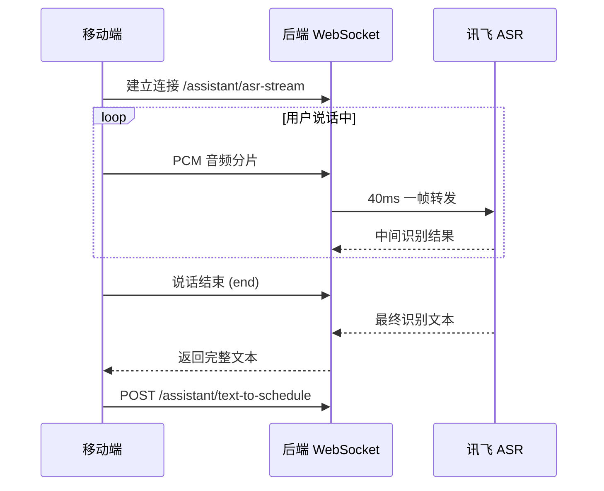

# 语音识别调用链路

## 分步说明

| 步骤 | 说明 |
| --- | --- |
| ① 建连 | 移动端通过 WebSocket 连接后端，后端向讯飞发起流式会话 |
| ② 流式上传 | 边录音边发送 PCM 分片，后端按 40ms 节流转发讯飞 |
| ③ 实时修正 | 讯飞持续返回中间结果，`TranscriptAccumulator` 处理 wpgs 动态修正 |
| ④ 结束取文 | 用户松手发送 end，后端通知讯飞结束，获取最终完整文本 |
| ⑤ 进入 AI | 拿到文本后调 `/text-to-schedule` 接口，交给 Spring AI 理解意图 |
