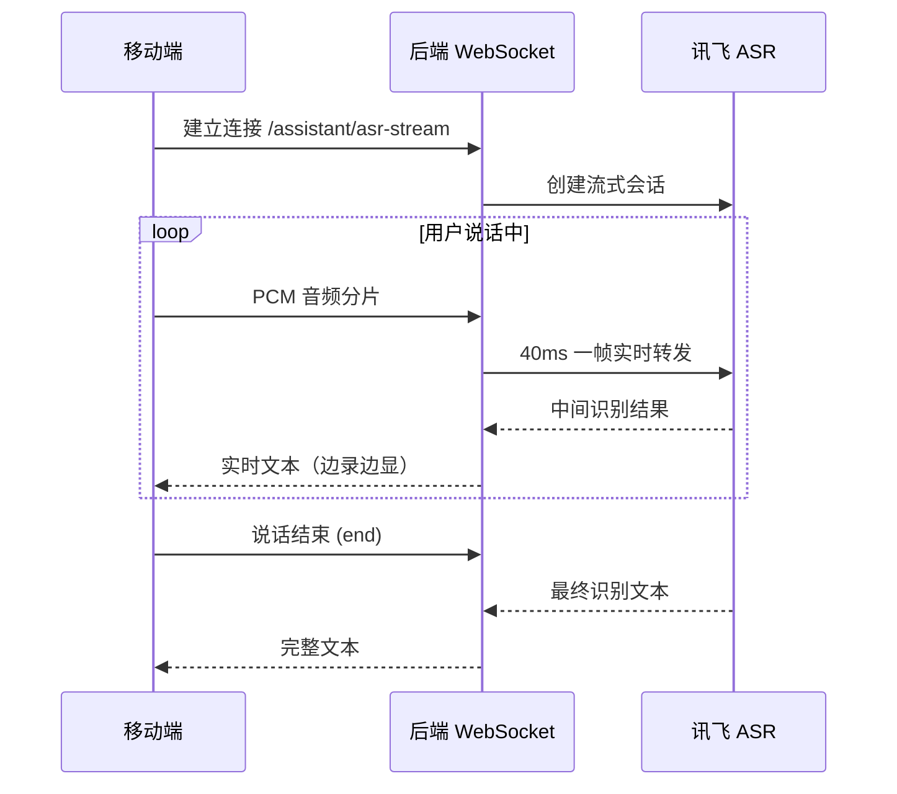

# 语音识别（ASR）流程

## 链路图

## 分步说明

| 步骤 | 说明 |
| --- | --- |
| ① 建连 | 移动端通过 WebSocket 连接后端，后端向讯飞发起流式会话 |
| ② 流式上传 | 录音过程中按 40ms 间隔逐帧发送 PCM 音频 |
| ③ 实时反馈 | 讯飞返回中间识别结果，后端透传，前端实时显示 |
| ④ 结束识别 | 用户停止说话，后端通知讯飞结束并获取最终完整文本 |

## 关键设计

- **后端中转**：密钥不暴露到客户端，由后端统一鉴权转发
- **流式识别**：边录边出字，不等录音结束
