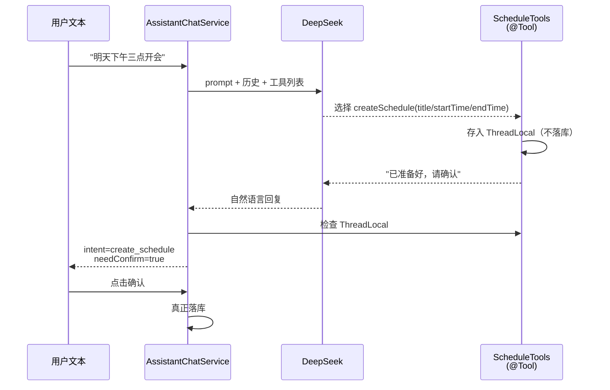
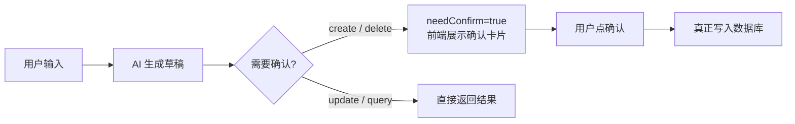

# 意图识别：Spring AI ToolCallback 日程增删改查

## 核心流程



## 四个 @Tool 方法

| 方法 | 执行方式 | 说明 |
| --- | --- | --- |
| `createSchedule` | 写入 ThreadLocal | 不直接落库，等用户确认 |
| `querySchedules` | 直接查 MySQL | 组装 LambdaQueryWrapper 动态查询 |
| `deleteSchedules` | 写入 ThreadLocal | 先查后删，批量存入待确认 |
| `updateSchedule` | 直接更新 MySQL | AI 先 query 再 update，无需确认 |

## 意图判断逻辑

```
call() 返回后 → 检查 ThreadLocal
  ├─ PENDING_REQUEST 非空    → create_schedule
  ├─ PENDING_DELETIONS 非空  → delete_schedule
  ├─ UPDATE_COUNT 非空       → update_schedule
  └─ 以上都为空              → chitchat / clarify
```

## 两段式提交



- **写操作**（创建/删除）必须用户二次确认
- **读操作**（查询）直接返回，不落草稿
- **更新**由 AI 先查询定位再修改，不经过确认
